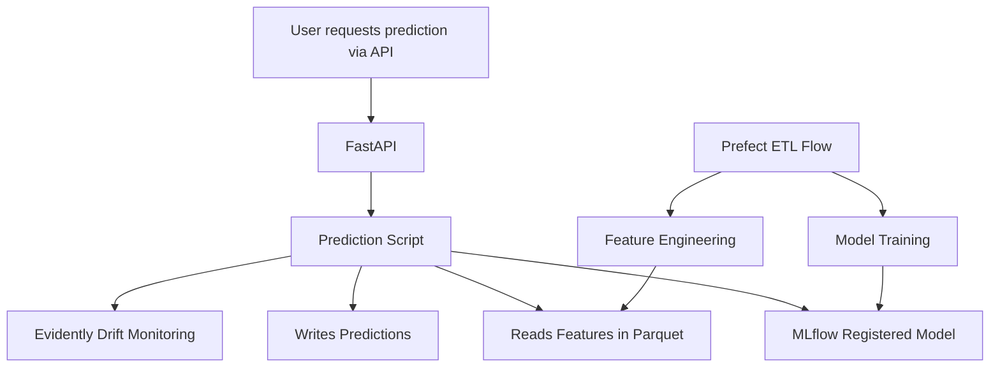

# MLOps-ETF-PEA

**Project:** MLOps pipeline to predict ETF daily returns and assess probability of reaching PEA annual thresholds using ML.

---

## 📊 Problem Description

This project addresses **retail investor challenges** in estimating if an ETF can meet the **PEA (Plan d'Epargne en Actions) yearly performance threshold** using historical data and ML models.

✅ **Pain points resolved:**

* Predict next-day ETF returns for decision support.
* Estimate probability of reaching user-defined thresholds.
* Automate pipeline for data ingestion, training, deployment, monitoring.

---

## 🛠️ Tech Stack

* **ML**: scikit-learn, lightgbm
* **Tracking**: MLflow
* **Orchestration**: Prefect
* **Deployment**: FastAPI, Uvicorn
* **Monitoring**: Evidently
* **Infra**: Terraform, LocalStack (AWS emulation)
* **CI/CD**: GitHub Actions
* **Tests**: pytest, unit tests
* **Lint/Format**: black, flake8, isort, pre-commit
* **Reproducibility**: requirements.txt, Makefile

---


## 📂 Repository Structure

* `notebooks/` : EDA, training (`02_train_model.ipynb`), prediction (`03_predict.ipynb`)
* `src/models/` : `train_model.py`, `predict.py`
* `src/pipeline/` : `prefect_flow.py` (workflow orchestration)
* `src/api/` : `main.py` (FastAPI deployment)
* `src/monitoring/` : `monitor.py` (monitoring pipeline)
* `infra/` : Terraform + LocalStack infra for emulated AWS S3
* `mlruns/` : MLflow runs and artifacts
* `.github/workflows/ci.yml` : CI/CD pipeline
* `Makefile`, `.pre-commit-config.yaml`, `requirements.txt`
* `tests/` : unit tests and pipeline tests

---
## 🖥️ System Architecture




---
## 🐳 Docker & LocalStack Setup
The project uses Docker and LocalStack to emulate AWS services locally.

**Prerequisites**
* Docker & docker-compose installed
* AWS CLI installed locally (or use the dockerized AWS CLI alternative)

**Install AWS CLI (if missing)**
```bash
pip install awscli
```
Or use your OS package manager.

**Running the stack**
```bash
docker-compose up -d
```
**Verify LocalStack S3**
```bash
aws --endpoint-url=http://localhost:4566 s3 ls
```
If you don’t want to install AWS CLI locally, run:
```bash
docker run --rm -it amazon/aws-cli --endpoint-url=http://host.docker.internal:4566 s3 ls
```
> **Note:** On Linux, replace `host.docker.internal` by `localhost` if needed.

---
## 🚀 Quickstart

```bash
# Install dependencies
pip install -r requirements.txt

# Format, lint, test
make format
make lint
make test

# Start Prefect ETL pipeline
python src/pipeline/prefect_flow.py

# Launch API locally
uvicorn src.api.main:app --reload

# Run monitoring pipeline
python src/monitoring/monitor.py
```

---

## 🪜 Evaluation Grid Mapping

| Criteria                                   | Status                                                    |
| ------------------------------------------ | --------------------------------------------------------- |
| **Problem description**                    | ✅ Well described                                          |
| **Cloud**                                  | ✅ LocalStack + Terraform (IaC), partial cloud             |
| **Experiment tracking and model registry** | ✅ MLflow tracking + registry                              |
| **Workflow orchestration**                 | ✅ Prefect orchestration                                   |
| **Model deployment**                       | ✅ FastAPI local deployment, containerisable               |
| **Model monitoring**                       | ✅ Evidently for metrics monitoring                        |
| **Reproducibility**                        | ✅ requirements.txt, Makefile, pre-commit, clear structure |
| **Best practices**                         | ✅ Tests, CI/CD, linting, formatting, Makefile, pre-commit |
---
## 📈 Results

* Trained LightGBM model on ETF return features with MLflow.
* Automated retraining workflow via Prefect.
* Deployed local API for predictions.
* Monitoring pipeline for performance drift.
* Full reproducibility with CI/CD, tests, formatting enforced.

---

## 🤝 Contributing

```bash
# Format and check lint before push
make format
make lint
```

Contributions, issues and PRs welcome.

---

## 📬 Contact

**Yann Pham Van**

[LinkedIn](https://www.linkedin.com/in/chasseur2valeurs/) | [GitHub](https://github.com/YannPhamVan)

---

## 🏁 Next improvements

✅ Containerize and deploy to cloud (AWS Lambda/Fargate).

✅ Add alert-based monitoring with Prefect triggers.

✅ Extend hyperparameter tuning workflows.

✅ Add Grafana dashboards if needed for advanced monitoring.

---

**Ready for peer review 🚀**

This README aligns with the Zoomcamp evaluation grid and guides reviewers smoothly through setup, dev, infra, and testing.
